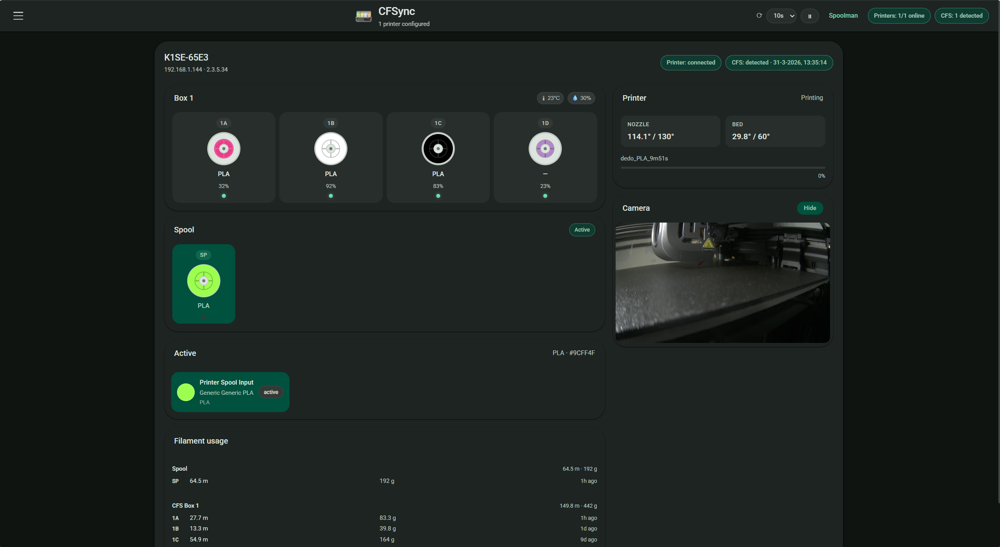

# CFSync

A local web dashboard for managing filament spools on **Creality K1 series printers with CFS** (Colour Filament System), including the K1, K1C, K1 Max, K1 SE, and K2 Plus. CFSync connects directly to the printer over WebSocket, reads live spool data from all CFS slots, and optionally syncs consumption back to [Spoolman](https://github.com/Donkie/Spoolman).



## Features

- Live CFS slot view — filament colour, material, and fill level per slot
- RFID spool percent from printer sensor; calculated percent for non-RFID spools via Spoolman
- Spoolman integration — link spools, track remaining weight, auto-report usage at job end
- **Two Spoolman sync modes** — direct reporting or Moonraker plugin (`SET_ACTIVE_SPOOL`)
- Serial-number-based auto-linking via SSH (CFTag-written spools link instantly on insert)
- Moonraker job tracking — attributes `filament_used` proportionally across active slots at print completion
- **Multi-printer support** — manage multiple printers from a single CFSync instance
- **Job history** — per-printer log of recent print jobs with filament usage breakdown
- **Spool reallocation** — manually assign usage to a specific slot after a print
- **SP slot** — tracks filament loaded directly into the printer (outside the CFS)
- Printer name and firmware version shown in header (read from WebSocket)
- Dark UI, no build step, runs as a systemd service

## Requirements

- Linux host on the same network as the printer (e.g. a Pi or the printer's companion board)
- Creality K1 series printer with CFS (K1, K1C, K1 Max, K1 SE, K2 Plus)
- Python 3.10+
- Optional: [Spoolman](https://github.com/Donkie/Spoolman) for spool tracking

## Install

```bash
curl -fsSL https://raw.githubusercontent.com/koen01/CFSync/refs/heads/spoolman/install.sh | sudo bash
```

The installer will prompt for:

| Prompt | Example |
|---|---|
| UI port | `8005` |
| Printer IP | `192.168.1.144` |
| Spoolman URL *(optional)* | `http://192.168.1.10:7912` |

After install, open `http://<host-ip>:<port>` in your browser.

## Configuration

All settings are available through the **cogwheel (⚙) modal** in the UI. They are stored in `data/config.json`:

```json
{
  "printer_urls": ["192.168.1.144"],
  "filament_diameter_mm": 1.75,
  "spoolman_url": "http://192.168.1.10:7912",
  "spoolman_mode": "direct"
}
```

The legacy `"printer_url"` (single string) is still accepted and migrated automatically.

### Multiple printers

Add all printer IPs to the `printer_urls` array:

```json
{
  "printer_urls": ["192.168.1.144", "192.168.1.145"]
}
```

Each printer gets its own state, job history, and Spoolman spool links. The UI shows a printer selector when more than one printer is configured.

## Spoolman integration

### Sync modes

CFSync supports two ways to report filament consumption to Spoolman. Set the mode in the settings modal (⚙).

**Direct mode** *(default)*

CFSync calls `PUT /api/v1/spool/{id}/use` directly on Spoolman when a print finishes or a manual allocation is made. No Moonraker configuration needed.

**Moonraker plugin mode**

CFSync calls the `SET_ACTIVE_SPOOL` / `CLEAR_ACTIVE_SPOOL` G-code macros via Moonraker. Moonraker's built-in Spoolman plugin then tracks consumption itself. This requires the `[spoolman]` section in `moonraker.conf` — see setup below.

### Moonraker plugin setup

1. **Configure Moonraker** — add to `moonraker.conf`:

```ini
[spoolman]
server: http://192.168.1.10:7912
```

2. **Restart Moonraker** after saving.

3. **In CFSync settings (⚙)**, set Spoolman URL to the same address and switch the sync mode to **Moonraker plugin**.

> Moonraker must be reachable from the CFSync host. CFSync uses the printer IP (port 7125) for Moonraker API calls. If your setup uses a different Moonraker URL you can configure it separately in `data/config.json` under `moonraker_url`.

> **Trusted clients:** CFSync's host IP must be in Moonraker's `trusted_clients` list. The default Moonraker config already includes `192.168.0.0/16` and `10.0.0.0/8`, so most LAN setups work without changes.

### Auto-linking via serial number (SSH)

When an RFID-tagged spool is inserted, CFSync SSHes into the printer and reads the spool data file to extract the chip's serial number. If it matches a Spoolman spool ID, the slot is linked immediately.

This is the primary auto-link mechanism and works out of the box with **[CFTag](https://github.com/koen01/cftag)** — a companion Android app that creates the Spoolman entry and writes the spool ID onto the RFID chip in one flow.

> Spools without a Creality RFID chip skip auto-linking and must be linked manually via the slot modal.

## Workflow — adding a new spool with RFID

1. **Open CFTag** → fill in filament details → tap **Create in Spoolman**. CFTag creates the spool entry and immediately prompts you to write the first RFID tag. Hold your phone to the tag, flip the spool, write the second tag — done in one flow.
2. **Load the spool** into a CFS slot.
3. **CFSync auto-links** the slot via the serial number — no manual action needed.

From this point on, inserting that spool into any CFS slot will auto-link it instantly. Filament consumption is reported back to Spoolman after each print.

## Fluidd panel

CFSync can inject a spool status panel into the **Fluidd** web UI. The panel script and setup instructions are available in the settings modal (⚙) under **Fluidd panel**.

Two delivery methods are supported:

- **Bookmarklet** — paste a one-liner into your browser's bookmarks bar and click it to activate
- **Tampermonkey** — install the userscript for automatic injection on every page load

## Development & testing

CFSync includes a mock printer server for local development without real hardware.

### Mock server

`mock_printer.py` simulates a K2 Plus — it runs a WebSocket CFS server (port 9999) and a Moonraker HTTP API (port 7125). Run multiple instances on different loopback IPs to test the multi-printer setup:

```bash
# In separate terminals:
python3 mock_printer.py --host 127.0.0.2 --name "Printer Alpha"
python3 mock_printer.py --host 127.0.0.3 --name "Printer Beta"
```

Then set `"printer_urls": ["127.0.0.2", "127.0.0.3"]` in `data/config.json` and start CFSync normally. All `127.x.x.x` addresses work as loopback aliases on Linux without extra configuration.

Each mock exposes a control API for triggering state changes:

```bash
# Simulate a print job lifecycle
curl -X POST http://127.0.0.2:7125/mock/print/start
curl -X POST http://127.0.0.2:7125/mock/print/complete

# Change a CFS slot (state 2 = RFID)
curl -X POST http://127.0.0.2:7125/mock/slot/1A \
     -H 'Content-Type: application/json' \
     -d '{"state": 2, "type": "PLA", "color": "#FF5733", "name": "Orange PLA", "vendor": "Bambu"}'

# Empty a slot
curl -X POST http://127.0.0.2:7125/mock/slot/2C/empty

# Switch active slot
curl -X POST http://127.0.0.2:7125/mock/slot/1B/select

# View full mock state
curl http://127.0.0.2:7125/mock/state
```

### Mocking SSH auto-linking

SSH auto-linking can be tested without a real SSH server using `mock_sshpass.sh`. It intercepts the `sshpass` call and fetches `material_box_info.json` from the mock's HTTP endpoint instead:

```bash
cp mock_sshpass.sh sshpass && chmod +x sshpass
PATH="$PWD:$PATH" uvicorn main:app --reload --host 0.0.0.0 --port 8000
```

To trigger auto-linking, set a slot's RFID to a plain integer matching a Spoolman spool ID:

```bash
curl -X POST http://127.0.0.2:7125/mock/slot/1A \
     -H 'Content-Type: application/json' \
     -d '{"state": 2, "rfid": "42"}'   # auto-links to Spoolman spool #42
```

## Update

```bash
curl -fsSL https://raw.githubusercontent.com/koen01/CFSync/refs/heads/spoolman/update.sh | sudo bash
```

## Logs

```bash
sudo journalctl -u filament-management -f
```

## Credits

- [jkef80/Filament-Management](https://github.com/jkef80/Filament-Management) — original Moonraker-based filament management that this project evolved from
- [DaviBe92/k2-websocket-re](https://github.com/DaviBe92/k2-websocket-re) — reverse-engineered Creality K2 WebSocket protocol documentation that made the CFS integration possible
